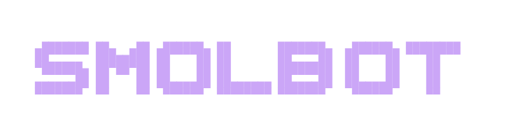

<div align="center">
  
  
  <p>
    <a href="https://github.com/Nomadcxx/smolbot/releases"></a>
    
    <a href="LICENSE"></a>
  </p>
</div>

A terminal-based AI assistant that runs on your own hardware. Chat with local or cloud AI models, manage persistent sessions, and automate tasks without relying on external services.

```bash
curl -sSL https://raw.githubusercontent.com/Nomadcxx/smolbot/main/install.sh | bash
```

## What It Does

SMOLBOT provides a self-hosted AI assistant that lives in your terminal. Unlike cloud-based assistants, you control the entire stack: the AI provider, your data, and where the assistant runs.

**Core capabilities:**

- **Local-first**: Run entirely offline with Ollama, or connect to cloud providers
- **Persistent sessions**: Conversations saved to SQLite, resume anytime
- **Multi-provider**: Switch between Ollama, OpenAI, Anthropic, Azure, or custom endpoints
- **TUI interface**: Full terminal UI for interactive chat
- **Channel integration**: Optional Signal/WhatsApp for notifications
- **Tool system**: Extensible tools for file operations and MCP servers

## Installation

### One-Liner

```bash
curl -sSL https://raw.githubusercontent.com/Nomadcxx/smolbot/main/install.sh | bash
```

### Manual

```bash
git clone https://github.com/Nomadcxx/smolbot.git
cd smolbot
go build -o install-smolbot ./cmd/installer
./install-smolbot
```

**Requirements:** Go 1.21+

## Quick Start

**1. Initialize**

The installer walks you through configuration:

```bash
./install-smolbot
```

Or if already installed:

```bash
nanobot onboard
```

**2. Configure** (`~/.nanobot/config.json`)

Minimal config for Ollama (local):

```json
{
  "agents": {
    "defaults": {
      "model": "llama3.1:8b",
      "provider": "ollama"
    }
  },
  "providers": {
    "ollama": {
      "apiBase": "http://localhost:11434/v1"
    }
  }
}
```

**3. Start**

```bash
# Terminal 1: Start the gateway
nanobot run

# Terminal 2: Launch TUI
nanobot-tui
```

## Configuration

### Providers

| Provider | Config | Auth |
|----------|--------|------|
| **Ollama** (local) | `apiBase: "http://localhost:11434/v1"` | None required |
| **OpenAI** | `apiKey: "sk-..."` | API key |
| **Anthropic** | `apiKey: "sk-ant-..."` | API key |
| **Azure** | `apiKey: "...", endpoint: "..."` | API key + endpoint |
| **Custom** | `apiBase: "...", apiKey: "..."` | OpenAI-compatible |

**Example - OpenAI:**

```json
{
  "providers": {
    "openai": {
      "apiKey": "sk-..."
    }
  },
  "agents": {
    "defaults": {
      "model": "gpt-4",
      "provider": "openai"
    }
  }
}
```

### Channels

Optional messaging integrations:

| Channel | Setup | Purpose |
|---------|-------|---------|
| **Signal** | signal-cli required | Notifications |
| **WhatsApp** | QR code scan | Notifications |

Enable in `config.json`:

```json
{
  "channels": {
    "signal": {
      "enabled": true,
      "cliPath": "signal-cli"
    },
    "whatsapp": {
      "enabled": true
    }
  }
}
```

### Tools

Built-in tool categories:

- **Web**: Search with Brave, Tavily, DuckDuckGo, or SearXNG
- **Exec**: Shell command execution (respects `restrictToWorkspace`)
- **MCP**: Model Context Protocol servers for external tools

Configure in `config.json`:

```json
{
  "tools": {
    "web": {
      "searchBackend": "duckduckgo",
      "maxResults": 5
    },
    "exec": {
      "restrictToWorkspace": true,
      "denyPatterns": ["rm -rf /"]
    }
  }
}
```

## Security

**Workspace Sandboxing:**

Set `tools.exec.restrictToWorkspace: true` to prevent the agent from accessing files outside the workspace directory.

**DM Pairing:**

For channel integrations, unknown senders receive a pairing code instead of immediate responses. Approve with:

```bash
nanobot pairing approve signal +1234567890
```

## Workspace Structure

```
~/.nanobot/
├── config.json          # Main configuration
├── sessions.db          # Chat history
└── workspace/
    ├── memory/          # Agent memory
    ├── SOUL.md          # Personality definition
    └── HEARTBEAT.md     # Periodic tasks
```

## Development

```bash
# Build daemon
go build -o nanobot ./cmd/nanobot

# Build TUI
go build -o nanobot-tui ./cmd/nanobot-tui

# Build installer
go build -o install-smolbot ./cmd/installer
```

## License

BSD 3-Clause License - see LICENSE file for details
